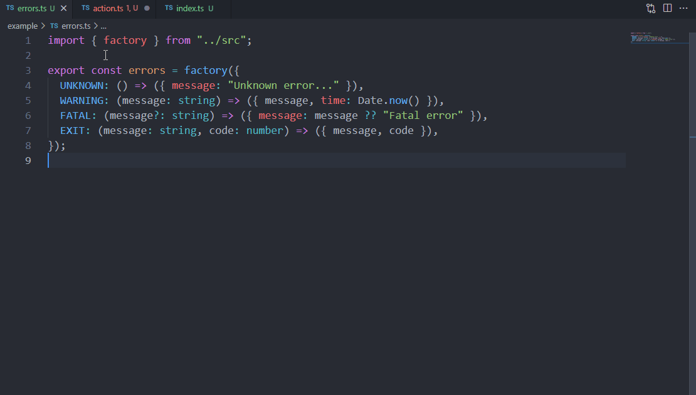

<h1 align="center">🔥 Type safe pojo error will help you to easily create typed and serializable error.</h1>

<table align="center">
  <tr>
    <td>
      <a href="https://github.com/skarab42/ts-pojo-error/actions/workflows/CI.yaml">
        
      </a>
    </td>
    <td>
      <a href="https://codecov.io/gh/skarab42/ts-pojo-error">
        
      </a>
    </td>
    <td>
      
    </td>
    <td>
      
    </td>
    <td>
      <a href="https://github.com/sponsors/skarab42">
        
      </a>
    </td>
    <td>
      <a href="https://www.twitch.tv/skarab42">
        
      </a>
    </td>
  </tr>
</table>

<p align="center">
  
</p>

# Intro

**The problem with exceptions is that once caught you don't know what type they are.** You can of course create a bunch of custom error classes and use `instanceof` to overcome this. The advantage of `ts-pojo-error` is that you have a single error type `PojoError` which can be easily typed and serialized.

# Features

- 🔥 Type safe & autocompletion
- 👓 Serializable output
- 🔗 [Stackable](https://github.com/tc39/proposal-error-cause) errors
- 🌌 Node or Browser
- 🌓 ESM or CJS
- ✅ Well tested

# Usage

## Installation

```bash
pnpm add @skarab/ts-pojo-error # yarn and npm also works
```

## Defining an error factory

- **factory(** errors: `PojoErrorTypes` **)** : `PojoFactory`

An error factory is constructed from a `Record` where the key is the type of the error and the value is a `callback` that defines the `PojoError`.
The `callback` parameters define the parameters passed at the creation of the error and the return value defines the data of the error.

```ts
// errors.ts

import { factory } from "@skarab/ts-pojo-error";

export const errors = factory({
  UNKNOWN: () => ({ message: "Unknown error..." }),
  WARNING: (message: string) => ({ message, time: Date.now() }),
  FATAL: (message?: string) => ({ message: message ?? "Fatal error" }),
  EXIT: (message: string, code: number) => ({ message, code }),
});
```

## Instantiating & Throwing errors

- **new(** type: `infered`, ...args: `infered[]` **)** : `PojoError`
- **throw(** type: `infered`, ...args: `infered[]` **)** : `never`

The first parameter is always the type of error, the following parameters are the ones you set in the factory.

> All parameters have support for autocompletion.

```ts
// action.ts

import { errors } from "./errors";

export function action() {
  // Do your awsome stuff...

  // ...something go wrong, throw an typed error
  throw errors.new("FATAL");

  // or with a custom error message
  throw errors.new("FATAL", "Oupsy!");

  // or by using the .throw helper
  errors.throw("FATAL");

  // or by using the fake enum
  errors.throw(errors.type.FATAL);
}
```

## Catching & Typing errors

- **is(** type: `infered`, error: `unknown` **)** : boolean
- **has(** error: `unknown` **)** : boolean

This is where it gets really interesting, the problem with exceptions is that once caught you don't know what type they are. You can of course create a bunch of custom error classes and use `instanceof` to overcome this. The advantage of `ts-pojo-error` is that you have a single error type `PojoError` which can be easily typed and serialized.

The `is` method is a [type guard](https://www.typescriptlang.org/docs/handbook/2/narrowing.html#using-type-predicates) that will narrow the error to the specific type if the original type is compatible.

> In the if block all properties are typed and have support for autocompletion.

```ts
// index.ts

import { action } from "./action";
import { errors } from "./errors";

try {
  action();
} catch (error) {
  error; // <- unknown type

  if (errors.is("FATAL", error)) {
    error; // <- PojoError instance with type "FATAL"

    error.message; // "Oupsy!": string

    error.type; // "FATAL": "FATAL"
    error.args; // ["Oupsy!"] : [message?: string | undefined]
    error.data; // { message: "Oupsy!" }: { message: string }

    error.cause; // Error | undefined (see "Stacking of errors" below)

    error.toObject(); // { type, args, data, stack?: string | undefined }
    error.toJSON(); // string
  }

  if (errors.has(error)) {
    error.type; // "UNKNOWN" | "WARNING" | "FATAL" | ...
  }

  if (error instanceof PojoError) {
    error.type; // any (Bad!)
  }
}
```

## Stacking of errors

- **newFrom(** cause: Error, type: `infered`, ...args: `infered[]` **)** : `PojoError`
- **throwFrom(** cause: Error, type: `infered`, ...args: `infered[]` **)** : `never`

Basically it adds a `.cause` property with the parent error to the newly created `PojoError`, see [Error Cause](https://github.com/tc39/proposal-error-cause) tc39 proposal for further information.

```ts
try {
  throw myErrors.new("UNKNOWN");
} catch (error) {
  throw myErrors.newFrom(error, "FATAL");
}
```

You can stack any type of error.

```ts
try {
  throw new Error("Unknown error");
} catch (error) {
  myErrors.throwFrom(error, "FATAL");
}
```

### Usage with [voxpelli/pony-cause](https://github.com/voxpelli/pony-cause)

This library coded by [@voxpelli](https://twitter.com/voxpelli/status/1438476680537034756) includes a couple of helpers inspired by VError, supporting both standard causes and VError causes.

```ts
import { stackWithCauses } from "pony-cause";

const error1 = myErrors.new("UNKNOWN");
const erorr2 = myErrors.newFrom(error1, "FATAL");
const error3 = myErrors.newFrom(error2, "WARNING", "Attention to danger !!!");
const error4 = myErrors.newFrom(
  erorr3,
  "PAGE_NOT_FOUND",
  "http://www.prout.com",
);

console.log("We had a mishap:", stackWithCauses(error4));
```

To make the example more readable I have replaced the full stack with `...` but the actual output contains it.

```bash
We had a mishap: PojoError: Page Not Found: http://www.prout.com
    at index.ts:191:31
    at ...
caused by: PojoError: Attention to danger !!!
    at index.ts:190:31
    at ...
caused by: PojoError: Fatal error
    at index.ts:189:31
    at ...
caused by: PojoError: Unknown error...
    at index.ts:188:34
    at ...
```

# Contributing 💜

See [CONTRIBUTING.md](https://github.com/skarab42/ts-pojo-error/blob/main/CONTRIBUTING.md)
